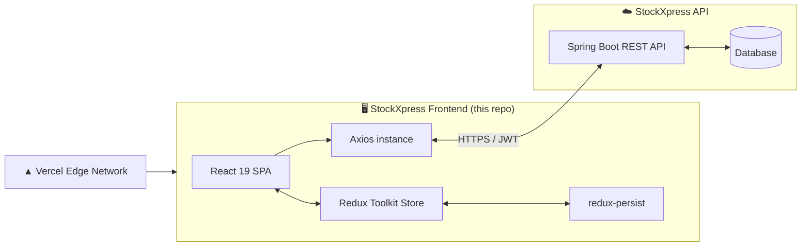

<div align="center">

# 📦 StockXpress — Frontend

### Enterprise Inventory & Warehouse Management — Client Application

*Real-time stock, role-based access, and a complete audit trail — built for teams that can't afford to guess.*

[](https://react.dev)
[](https://vitejs.dev)
[](https://tailwindcss.com)
[](https://redux-toolkit.js.org)
[](https://pnpm.io)
[](https://vercel.com)
[](#-license)

[Overview](#-overview) •
[Features](#-key-features) •
[Tech Stack](#-tech-stack) •
[Getting Started](#-getting-started) •
[Architecture](#-project-architecture) •
[Deployment](#-deployment)

</div>

---

## 📖 Table of Contents

1. [Overview](#-overview)
2. [Key Features](#-key-features)
3. [Tech Stack](#-tech-stack)
4. [System Architecture](#-system-architecture)
5. [Project Structure](#-project-structure)
6. [Prerequisites](#-prerequisites)
7. [Getting Started](#-getting-started)
8. [Environment Variables](#-environment-variables)
9. [Available Scripts](#-available-scripts)
10. [Routing Map](#-routing-map)
11. [State Management](#-state-management)
12. [API Layer](#-api-layer)
13. [Authentication & Authorization](#-authentication--authorization)
14. [Design System](#-design-system)
15. [Code Quality & Linting](#-code-quality--linting)
16. [Deployment](#-deployment)
17. [Maintainer](#-maintainer)

---

## 🧭 Overview

**StockXpress Frontend** is the client application for **StockXpress** — a B2B inventory and warehouse management platform built to handle high-traffic scenarios such as flash sales, concurrent stock updates, and multi-role team operations without ever overselling.

This repository contains the **single-page application (SPA)** that consumes the StockXpress REST API, providing tailored experiences for three distinct user roles: **Customer**, **Warehouse Manager**, and **Admin**.

> 🎯 **Design principle:** every screen in this application is role-aware. What a user sees, and what they can do, is determined entirely by their assigned role — enforced both at the UI layer and by the backend.

---

## ✨ Key Features

| | Feature | Description |
|---|---|---|
| 🔐 | **Role-based access control** | Three-tier permission model (Customer / Warehouse Manager / Admin), each with a distinct dashboard and navigation |
| ⚡ | **Real-time stock visibility** | Live inventory counts, low-stock detection, and out-of-stock protection surfaced directly in the UI |
| 📊 | **Admin command center** | Revenue, order, and user analytics with a live audit trail of every inventory change |
| 🧾 | **Full order lifecycle** | Placement, tracking, cancellation, and status/payment updates across the entire order journey |
| 🗃️ | **Bulk inventory tools** | Single and batch stock updates for warehouse operations at scale |
| 🪵 | **Inventory audit trail** | Every stock change is traceable — what changed, who changed it, and when |
| 🔑 | **Persistent, secure sessions** | Token-based authentication with `redux-persist` for a seamless return experience |
| 📱 | **Mobile-first responsive UI** | Every page is designed mobile-first and scales cleanly up to large desktop viewports |
| 🎨 | **Cohesive design system** | A custom dark, color-coded UI language applied consistently across the entire application |

---

## 🛠️ Tech Stack

### Core

| Category | Technology | Version |
|---|---|---|
| UI Library | [React](https://react.dev) | `19.2.8` |
| Build Tool | [Vite](https://vitejs.dev) | `8.2.0` |
| Styling | [Tailwind CSS](https://tailwindcss.com) (via `@tailwindcss/vite`) | `4.3.3` |
| Routing | [React Router](https://reactrouter.com) | `7.18.2` |
| State Management | [Redux Toolkit](https://redux-toolkit.js.org) + [React Redux](https://react-redux.js.org) | `2.12.0` / `9.3.0` |
| State Persistence | [redux-persist](https://github.com/rt2zz/redux-persist) | `6.0.0` |
| HTTP Client | [Axios](https://axios-http.com) | `1.19.0` |
| Notifications | [react-hot-toast](https://react-hot-toast.com) | `2.6.0` |
| Icons | [lucide-react](https://lucide.dev) | `1.31.0` |

### Tooling & Quality

| Category | Technology | Version |
|---|---|---|
| Linting | [ESLint](https://eslint.org) | `10.8.0` |
| React Fast Refresh | `@vitejs/plugin-react` | `6.0.4` |
| React Hooks Rules | `eslint-plugin-react-hooks` | `7.1.1` |
| React Refresh Rules | `eslint-plugin-react-refresh` | `0.5.3` |
| Package Manager | [pnpm](https://pnpm.io) | — |
| Hosting / CI-CD | [Vercel](https://vercel.com) | — |

---

## 🏗️ System Architecture



**Request lifecycle:**

1. A component dispatches an async thunk (e.g. `loginUser`, `getDashboardStats`).
2. The relevant slice in `store/slices/` handles the request lifecycle (`pending` → `fulfilled` / `rejected`).
3. The API layer (`src/api/`) makes the actual HTTP call through a shared, pre-configured `axios` instance (`axiosConfig.js`), which attaches auth headers and handles token refresh.
4. Redux state updates, `redux-persist` syncs relevant slices to storage, and connected components re-render.
5. Route access is gated by `PrivateRoute` / `PublicRoute`, which read the current auth state to allow, redirect, or deny access.

---

## 📂 Project Structure

```text
StockXpressFrontend/
├── public/
│   ├── favicon.svg
│   └── icons.svg
├── src/
│   ├── api/                       # 🔌 API layer — one file per backend resource
│   │   ├── adminApi.js            #    Admin-only endpoints (stats, users, revenue)
│   │   ├── authApi.js             #    Login, register, refresh, logout
│   │   ├── axiosConfig.js         #    Shared axios instance, interceptors
│   │   ├── inventoryApi.js        #    Inventory logs / audit trail
│   │   ├── orderApi.js            #    Order placement, tracking, status
│   │   └── productApi.js          #    Product catalog & stock
│   │
│   ├── assets/                    # Static images/icons bundled by Vite
│   │
│   ├── components/
│   │   └── common/                # 🧩 Shared layout & guard components
│   │       ├── Layout.jsx         #    App shell — Navbar + Sidebar + <Outlet/>
│   │       ├── Loader.jsx         #    Themed loading spinner (inline & full-screen)
│   │       ├── Navbar.jsx         #    Top bar — branding, user, logout
│   │       ├── Sidebar.jsx        #    Role-filtered navigation
│   │       ├── PrivateRoute.jsx   #    Route guard — requires authentication
│   │       └── PublicRoute.jsx    #    Route guard — redirects authenticated users
│   │
│   ├── pages/                     # 📄 Route-level screens (see Routing Map below)
│   │   ├── AdminDashboardPage.jsx
│   │   ├── AdminRegisterPage.jsx
│   │   ├── AllOrdersPage.jsx
│   │   ├── BulkStockUpdatePage.jsx
│   │   ├── CreateProductPage.jsx
│   │   ├── EditProductPage.jsx
│   │   ├── HomePage.jsx
│   │   ├── InventoryPage.jsx
│   │   ├── LandingPage.jsx
│   │   ├── LoginPage.jsx
│   │   ├── LowStockProductsPage.jsx
│   │   ├── MyOrdersPage.jsx
│   │   ├── NotFoundPage.jsx
│   │   ├── OrderConfirmationPage.jsx
│   │   ├── OrderDetailsPage.jsx
│   │   ├── OrdersRedirectPage.jsx
│   │   ├── PlaceOrderPage.jsx
│   │   ├── ProductDetailsPage.jsx
│   │   ├── ProductsPage.jsx
│   │   ├── RegisterPage.jsx
│   │   ├── StockUpdatePage.jsx
│   │   ├── UserManagementPage.jsx
│   │   └── UserProfilePage.jsx
│   │
│   ├── store/                     # 🗄️ Redux Toolkit store
│   │   ├── slices/
│   │   │   ├── adminSlice.js      #    Admin dashboard / user management state
│   │   │   ├── authSlice.js       #    Auth state — user, role, tokens, status
│   │   │   ├── ordersSlice.js     #    Order state
│   │   │   └── productSlice.js    #    Product / inventory state
│   │   ├── hooks.js               #    Typed `useAppDispatch` / `useAppSelector`
│   │   └── index.js               #    Store configuration + persist setup
│   │
│   ├── utils/
│   │   ├── constants.js           #    App-wide constants (roles, statuses, etc.)
│   │   ├── helpers.jsx            #    Shared icon set + small utility functions
│   │   ├── toast.js               #    react-hot-toast wrapper helpers
│   │   └── validators.js          #    Form validation helpers
│   │
│   ├── App.jsx                    # Route definitions
│   ├── App.css
│   ├── index.css                  # Tailwind entry point
│   └── main.jsx                   # Application entry point
│
├── .env                           # Local environment variables (not committed)
├── vercel.json                    # Vercel routing/build configuration
├── vite.config.js
├── eslint.config.js
├── package.json
└── pnpm-lock.yaml
```

---

## ✅ Prerequisites

Before you begin, ensure you have the following installed:

| Requirement | Recommended Version |
|---|---|
| [Node.js](https://nodejs.org) | ≥ 20.x LTS |
| [pnpm](https://pnpm.io/installation) | ≥ 9.x |
| Git | Latest stable |

> This project **exclusively uses `pnpm`** as its package manager. Using `npm` or `yarn` may produce a conflicting lockfile — please avoid mixing package managers in this repository.

---

## 🚀 Getting Started

### 1. Clone the repository

```bash
git clone https://github.com/TechFourgeBuild/StockXpress-frontend.git
cd StockXpressFrontend
```

### 2. Install dependencies

```bash
pnpm install
```

### 3. Configure environment variables

Copy the example file (or create `.env` manually) and fill in the required values — see [Environment Variables](#-environment-variables) below.

```bash
cp .env.example .env   # if an example file exists in your repo
```

### 4. Run the development server

```bash
pnpm dev
```

The app will be available at **`http://localhost:5173`** by default.

### 5. Build for production

```bash
pnpm build
```

### 6. Preview the production build locally

```bash
pnpm preview
```

---

## 🔐 Environment Variables

This is a **Vite** project — all environment variables exposed to the client **must** be prefixed with `VITE_`.

| Variable | Description | Example |
|---|---|---|
| `VITE_API_BASE_URL` | Base URL of the StockXpress backend API | `https://api.stockxpress.example.com/api/v1` |

> ⚠️ **Adjust the table above to match the exact variable names used in your `.env` file.** Never commit `.env` to version control — it is already excluded via `.gitignore`.

When deploying to **Vercel**, add the same variables under **Project → Settings → Environment Variables** for each environment (Production / Preview / Development).

---

## 📜 Available Scripts

| Command | Description |
|---|---|
| `pnpm dev` | Starts the Vite development server with hot module replacement |
| `pnpm build` | Builds an optimized production bundle into `dist/` |
| `pnpm lint` | Runs ESLint across the entire codebase |
| `pnpm preview` | Serves the production build locally, for a final pre-deploy check |

---

## 🗺️ Routing Map

The table below reflects the intended role-based access for each page. **Verify this against your actual route definitions in `App.jsx`** and adjust as needed — it's included here as living documentation, not a source of truth.

| Page | Suggested Route | Public | Customer | Warehouse Manager | Admin |
|---|---|:---:|:---:|:---:|:---:|
| `LandingPage` | `/` | ✅ | ✅ | ✅ | ✅ |
| `LoginPage` | `/login` | ✅ | — | — | — |
| `RegisterPage` | `/register` | ✅ | — | — | — |
| `HomePage` | `/app` | — | ✅ | ✅ | ✅ |
| `ProductsPage` | `/products` | — | ✅ | ✅ | ✅ |
| `ProductDetailsPage` | `/products/:id` | — | ✅ | ✅ | ✅ |
| `PlaceOrderPage` | `/orders/place` | — | ✅ | — | — |
| `MyOrdersPage` | `/orders/my-orders` | — | ✅ | — | — |
| `OrderConfirmationPage` | `/orders/confirmation/:id` | — | ✅ | — | — |
| `OrdersRedirectPage` | `/orders` | — | ✅ | ✅ | ✅ |
| `AllOrdersPage` | `/orders/all` | — | — | ✅ | ✅ |
| `OrderDetailsPage` | `/orders/:id` | — | ✅ | ✅ | ✅ |
| `StockUpdatePage` | `/products/:id/stock` | — | — | ✅ | ✅ |
| `BulkStockUpdatePage` | `/products/bulk-update` | — | — | ✅ | ✅ |
| `LowStockProductsPage` | `/products/low-stock` | — | — | ✅ | ✅ |
| `InventoryPage` | `/inventory/logs` | — | — | ✅ | ✅ |
| `CreateProductPage` | `/products/create` | — | — | — | ✅ |
| `EditProductPage` | `/products/:id/edit` | — | — | — | ✅ |
| `AdminDashboardPage` | `/admin/dashboard` | — | — | — | ✅ |
| `AdminRegisterPage` | `/admin/register` | — | — | — | ✅ |
| `UserManagementPage` | `/admin/users` | — | — | — | ✅ |
| `UserProfilePage` | `/profile` | — | ✅ | ✅ | ✅ |
| `NotFoundPage` | `*` | ✅ | ✅ | ✅ | ✅ |

**Legend:** ✅ = accessible · — = not accessible / not applicable

Access enforcement happens at two levels:

- **`PublicRoute`** — redirects an already-authenticated user away from public-only pages (e.g. Login, Register).
- **`PrivateRoute`** — requires authentication, and optionally a specific role, before rendering the wrapped page. Unauthorized access falls back to a redirect or `NotFoundPage`.

---

## 🗄️ State Management

The application uses **Redux Toolkit** for predictable, centralized state, with **`redux-persist`** to survive page reloads.

| Slice | Responsibility |
|---|---|
| `authSlice` | Current user, role, authentication status, tokens, login/register/logout thunks |
| `adminSlice` | Dashboard statistics, user management, admin-only aggregated data |
| `productSlice` | Product catalog, stock levels, category filters |
| `ordersSlice` | Order lists, order details, order status transitions |

**Conventions:**

- Async operations use `createAsyncThunk`, with `pending` / `fulfilled` / `rejected` handled via `extraReducers`.
- Components read state through `store/hooks.js` (`useAppDispatch`, `useAppSelector`) rather than the raw `react-redux` hooks, to keep store access consistent and type-safe.
- Only the slices that need to survive a refresh (e.g. `auth`) are included in the `redux-persist` whitelist — configured in `store/index.js`.

---

## 🔌 API Layer

All HTTP communication is isolated inside `src/api/`, keeping components and slices free of networking concerns.

| File | Responsibility |
|---|---|
| `axiosConfig.js` | Creates the shared Axios instance — base URL, default headers, request/response interceptors (auth token attachment, refresh-on-401 handling) |
| `authApi.js` | `login`, `register`, `refreshToken`, `logout`, `getProfile` |
| `adminApi.js` | Dashboard stats, revenue, user/product counts, recent orders, low-stock report |
| `productApi.js` | Product CRUD, category filtering, stock updates (single & bulk) |
| `orderApi.js` | Order placement, retrieval, cancellation, status & payment updates |
| `inventoryApi.js` | Inventory audit log retrieval (by product, by user, by type) |

> 📌 **Pattern:** slices never call `axios` directly — they call functions exported from `src/api/`, keeping the HTTP contract in one place and making the backend easy to mock or swap in tests.

---

## 🔑 Authentication & Authorization

StockXpress uses **token-based authentication** against the backend, with three enforced roles:

| Role | Description |
|---|---|
| 🛒 `CUSTOMER` | Default role on registration — can browse, order, and track purchases |
| 🏭 `WAREHOUSE_MANAGER` | Manages stock levels, fulfills orders, reviews inventory activity |
| 👑 `ADMIN` | Full platform control — catalog, team, orders, and analytics |

**Client-side flow:**

1. On login/register, tokens and user/role data are stored in the `auth` slice and persisted via `redux-persist`.
2. The shared Axios instance attaches the access token to every outgoing request.
3. On a `401`, the interceptor attempts a silent token refresh before retrying the original request; on failure, the user is logged out and redirected to `/login`.
4. `PrivateRoute` reads `role` from the store to gate access to role-specific pages; `Sidebar` filters visible navigation links using the same role value.

---

## 🎨 Design System

The UI follows a single, consistent design language across every page:

| Token | Value | Usage |
|---|---|---|
| Background | `#0B0E14` | App base |
| Surface | `#131720` | Cards, panels |
| Border | `#232A38` | Dividers, card outlines |
| Text (primary) | `#E8EAED` | Headings, primary copy |
| Text (muted) | `#8B93A1` | Secondary copy, labels |

**Typography:** `Space Grotesk` (display/headings) · `Inter` (body) · `JetBrains Mono` (data, labels, kickers)

**Accent palette** — each kind of data keeps a consistent color everywhere it appears in the app:

| Color | Hex | Meaning |
|---|---|---|
| 🟢 Green | `#4ADE80` | Products / inventory |
| 🟣 Violet | `#A78BFA` | Users / people |
| 🩷 Pink | `#F472B6` | Orders / transactions |
| 🟡 Amber | `#FBBF24` | Needs attention soon |
| 🔴 Rose | `#FB7185` | Needs attention now |
| 🔷 Teal | `#34D1BF` | Revenue / success |
| 🟠 Orange | `#FF6B1A` | Admin role / primary actions |

The application is built **mobile-first**: every layout is authored for the smallest viewport first, then progressively enhanced at `sm:` / `md:` / `lg:` breakpoints.

---

## 🧹 Code Quality & Linting

```bash
pnpm lint
```

ESLint is configured with:

- `eslint-plugin-react-hooks` — enforces the Rules of Hooks
- `eslint-plugin-react-refresh` — ensures components remain compatible with Vite's Fast Refresh

> It's recommended to run `pnpm lint` before every commit and as a required check in CI.

---

## ☁️ Deployment

This project is deployed on **[Vercel](https://vercel.com)**.

| Setting | Value |
|---|---|
| Framework Preset | Vite |
| Build Command | `pnpm build` |
| Output Directory | `dist` |
| Install Command | `pnpm install` |
| Config File | `vercel.json` |

**Deployment flow:**

1. Push to the connected Git branch.
2. Vercel triggers a new build using the settings above.
3. Environment variables configured in the Vercel dashboard are injected at build time.
4. `vercel.json` handles SPA fallback routing, ensuring client-side routes (e.g. `/products/42`) resolve correctly on a hard refresh instead of returning a 404.

> 🔁 Since this is a single-page application, ensure `vercel.json` rewrites all paths to `index.html` so React Router can take over client-side routing.


---


## 👤 Maintainer

**Aman** — Backend-leaning full-stack developer, building StockXpress end-to-end (Spring Boot API + this React frontend).

<div align="center">

---

Made with ⚡ and a lot of ☕ — **StockXpress**, an inventory platform that doesn't guess.

</div>
